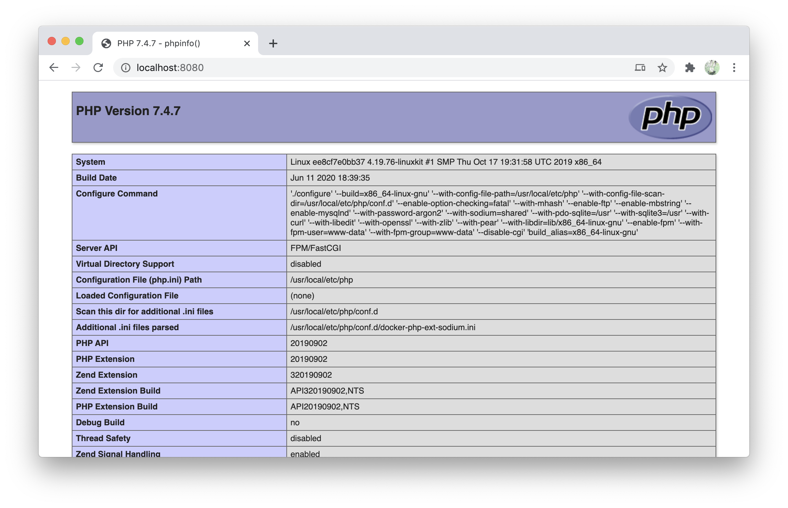

出来るだけ最小限でdocker、nginx、phpの環境を作成してみた

http://localhost:8080/ にアクセスした場合に、index.phpかindex.htmlがあればそれを表示するように設定

# Usage

```shell
git clone git@github.com:okumurakengo/docker-nginx-php.git
cd docker-nginx-php
docker-compose up -d
```



```shell
docker-compose stop
```
